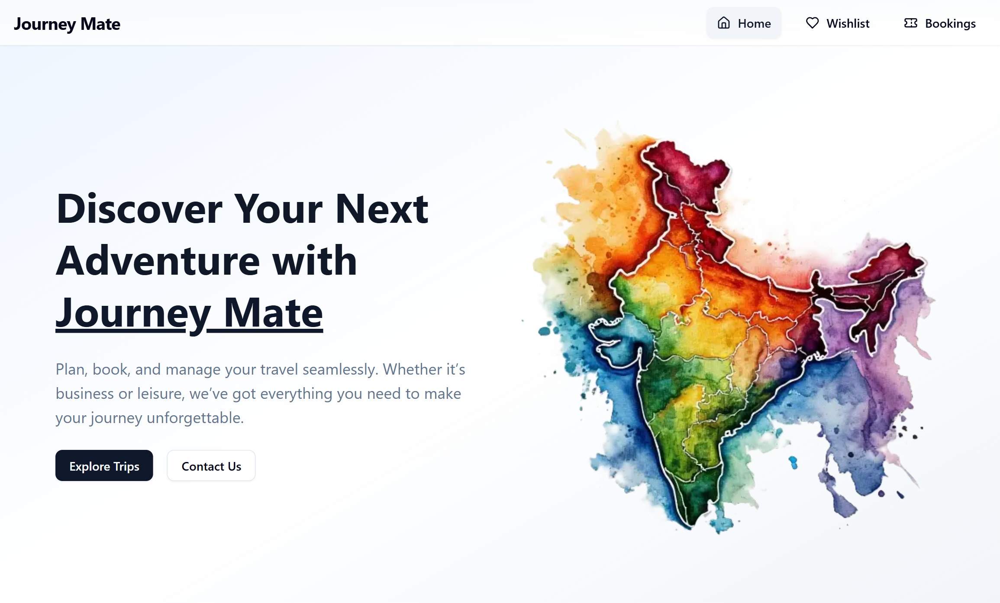
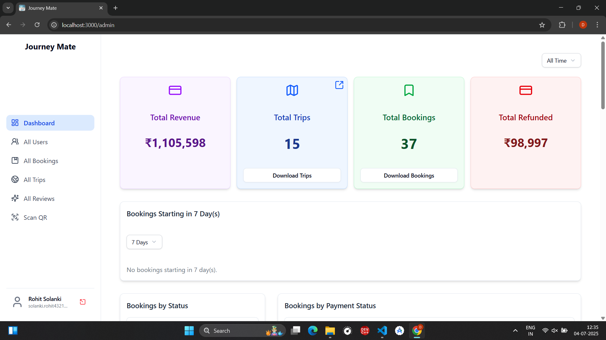
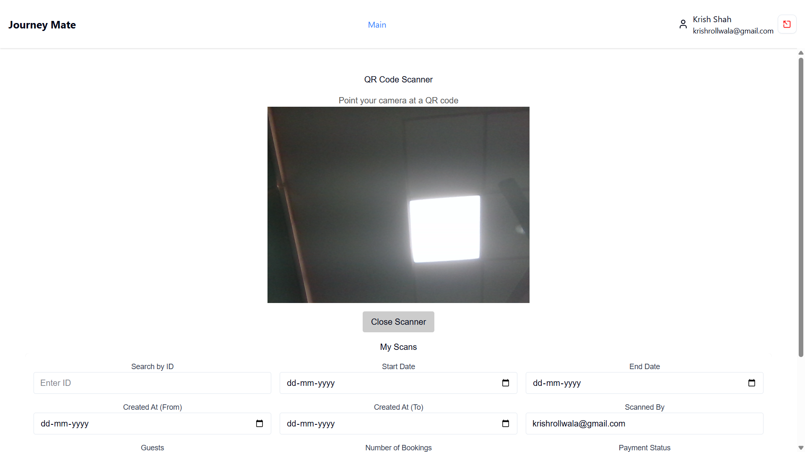

# 🌍 Journey Mate

[Link1: https://journeymate.vercel.app](https://journeymate.vercel.app)

Journey Mate is your smart travel assistant – a modern web-based travel management system built for planning, booking, and managing tours with ease. Designed as a **BSc Computer Science Semester 6 project**, it features a **multi-user architecture**, **QR-based booking verification**, and a complete **admin dashboard** for full control.

## 🧾 Project Overview

Journey Mate offers an all-in-one solution for travelers, administrators, and checkers. With a strong focus on user experience and management efficiency, the system is powered by the latest technologies including **Next.js**, **MongoDB**, **Appwrite**, and **QR code integration**.

### 🔐 Multi-User System
- **Normal Users** – Browse travel packages and book tours
- **Admins** – Manage the entire system (users, packages, analytics)
- **Checkers** – Verify bookings and quality control using QR codes

### 📅 Admin Dashboard
- Manage travel packages with pricing, itineraries, and availability
- Handle users and bookings efficiently
- Visualize analytics to understand system performance

### 📲 QR Code Booking Verification
- Generate digital QR codes for bookings
- Use scanning to verify and check-in bookings

---

## 📸 System Interface Previews

### Home:

### ADMIN:

### Checker:

---

## 🛠️ Tech Stack

### 🔧 Frameworks & Languages
- Next.js
- React.js
- TypeScript, JavaScript
- Tailwind CSS
- Node.js

### 🧩 Backend & Auth
- MongoDB
- Appwrite (Authentication + User Management)

### 📦 Features
- API Routes (Next.js)
- QR Code generation and scanning
- Role-based access (Admin, User, Checker)

---

## 🎯 Project Objectives

- ✅ Build a scalable travel management system
- ✅ Implement secure authentication for multiple roles
- ✅ Integrate QR code booking verification
- ✅ Enable full control for administrators
- ✅ Practice full-stack web development using modern tools

---

## 📚 Learning Outcomes

- Mastered full-stack development using **Next.js + MongoDB**
- Implemented **role-based access control**
- Developed **QR code scanning and generation workflows**
- Learned system design, API building, and modular architecture

---

## 👨‍💻 Developer Info

**Name:** Rohit Solanki  
📧 Emails:
- solanki.rohit.harishbhai@gmail.com
- solanki.rohit6105@gmail.com

---

## 📖 Academic Details

| Key | Info |
|-----|------|
| 🎓 Course | BSc Computer Science |
| 🗓️ Semester | 6th Semester |
| 📅 Academic Year | 2024–2025 |
| 📌 Project Type | Final Year Academic Project |

---

## 🤝 Contact & Feedback

If you're interested in collaborating, hiring, or have any feedback on the project:

👉 [Contact Me](mailto:solanki.rohit.harishbhai@gmail.com)  
📞 Phone: +91 9099536912

---

> *“This project demonstrates the practical application of full-stack web development concepts, authentication, QR-based workflows, and role-based access control learned during the course.”*
